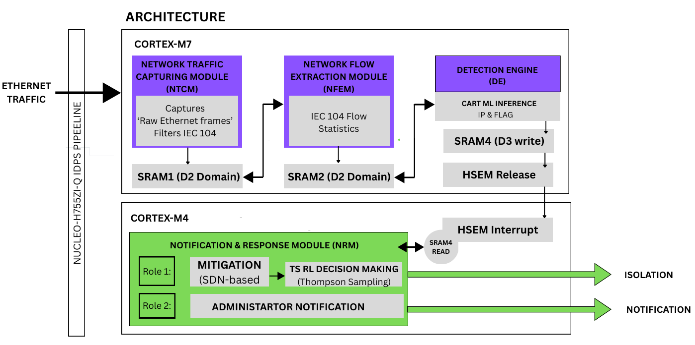

# Industrial Data Protection System (IDPS)

A dual-core SDN-based intrusion detection and prevention system targeting industrial IoT networks, with a focus on IEC 104 protocol monitoring and AI-driven threat detection.

## Project Status

**Current Phase:** CM7 (CORTEX-M7) implementation in progress  
**Completion:** ~50% (Detection pipeline complete, response/mitigation pending)

## Architecture Overview

The IDPS is deployed on an **STM32H755ZI** dual-core microcontroller, with workload distributed between Cortex-M7 and Cortex-M4 cores:

- **CORTEX-M7** (Primary Detection Pipeline):
  - Network Traffic Capturing Module (NTCM)
  - Network Flow Extraction Module (NFEM)
  - Detection Engine (DE) with ML inference
  
- **CORTEX-M4** (Response & Mitigation) - *Pending Implementation*:
  - Notification & Response Module (NRM)
  - SDN-based traffic isolation
  - Thompson Sampling-based decision making
  - Administrator notifications



## CM7 Implementation (Current)

### Core Modules

#### 1. **Network Traffic Capturing Module (NTCM)**
- Captures raw Ethernet frames at line rate
- Filters for IEC 104 protocol traffic
- Manages 64-slot DMA ring buffer (SRAM1 - D2 Domain)
- PTP-enabled timestamping for precise packet timing
- Promiscuous mode for comprehensive traffic visibility

#### 2. **Network Flow Extraction Module (NFEM)**
- Extracts bidirectional IEC 104 flow statistics
- Computes time-windowed features (default: configurable window)
- Generates feature vectors for ML inference
- Stores aggregated flows in SRAM2 (D2 Domain)

#### 3. **Detection Engine (DE)**
- Runs CART (Classification and Regression Trees) ML inference
- Classifies flows as `LABEL_NORMAL` or anomalous
- Writes inference results to SRAM4 (D3 write domain)
- Triggers inter-core signaling via HSEM for alerts

### Data Flow

```
Raw Ethernet Frames
        ↓
    [NTCM]
   (Capture & Filter)
        ↓
   SRAM1 (Ring Buffer)
        ↓
    [NFEM]
   (Flow Statistics)
        ↓
   SRAM2 (Accumulator)
        ↓
    [DE]
   (ML Inference)
        ↓
   SRAM4 (D3 write)
        ↓
    [HSEM Release]
    (to CM4)
```

### Key Features

- **Real-time packet processing**: Non-blocking DMA-driven architecture
- **Dual-core synchronization**: HSEM (Hardware Semaphore) for inter-core communication
- **Memory-efficient**: Partitioned SRAM access to minimize contention
- **Timestamped analysis**: PTP-synchronized packet timestamps for correlation

## Pending Features (CM4)

- [ ] Notification & Response Module (NRM)
- [ ] SDN-based traffic isolation policies
- [ ] Thompson Sampling algorithm for dynamic mitigation
- [ ] Administrator alerting system
- [ ] IEC 104-specific response actions

## Memory Layout

**Overall SRAM:** 800 KB across multiple domains

| Region      | Address      | Size   | Domain | Purpose                          |
|-------------|--------------|--------|--------|----------------------------------|
| DTCMRAM     | 0x20000000   | 128 KB | D1     | Code/Stack (CPU closely coupled) |
| RAM_D1      | 0x24000000   | 512 KB | D1     | Program code, data, heap/stack   |
| SRAM1       | 0x30000000   | 256 KB | D2     | **NTCM packet ring buffer**      |
| SRAM2       | 0x30040000   | 32 KB  | D2     | **NFEM flow accumulator**        |
| RAM_D2      | 0x30000000   | 288 KB | D2     | (includes SRAM1 + SRAM2)         |
| SRAM4       | 0x38000000   | 4 KB   | D3     | **DE detection results (CM7→CM4)**|
| RAM_D3      | 0x38000000   | 64 KB  | D3     | (includes SRAM4)                 |
| ITCMRAM     | 0x00000000   | 64 KB  | I-Cache| Instruction cache                |

**Core Memory Assignments:**
- **CM7 (M7 Core):** RAM_D1 (code), SRAM1/SRAM2 (read/write D2), SRAM4 (write D3)
- **CM4 (M4 Core):** Awaiting implementation (will read SRAM4 for detection alerts)

## References

- **IEC 104 Protocol**: Industrial control system communication standard
- **Thompson Sampling**: Multi-armed bandit approach for adaptive decision making
- **CART Algorithm**: Interpretable tree-based classification for edge ML
- **STM32H755**: Dual-Cortex MCU with advanced DMA and HSEM capabilities

## Project Documentation

- `IDPS_ARCHITECTURE.pdf` - System architecture, dataflow, and memory partitioning
- `Modeling_Detecting_and_Mitigating_Threats_Against_Industrial_Healthcare_Systems_A_Combined_Software_Defined_Networking_and_Reinforcement_Learning_Approach.pdf` - Research background

---

**Phase 1 (CM7 - In Progress):** Detection pipeline implementation  
**Phase 2 (CM4 - Pending):** Response and mitigation strategies
